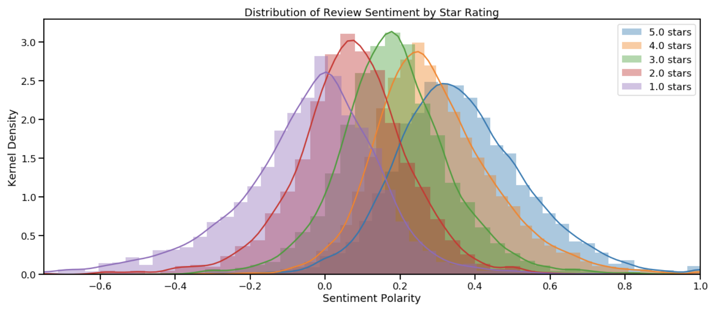
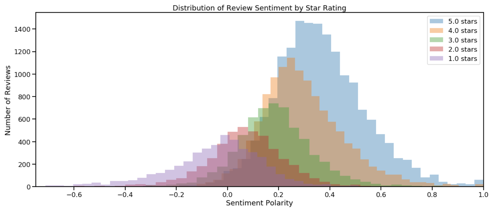
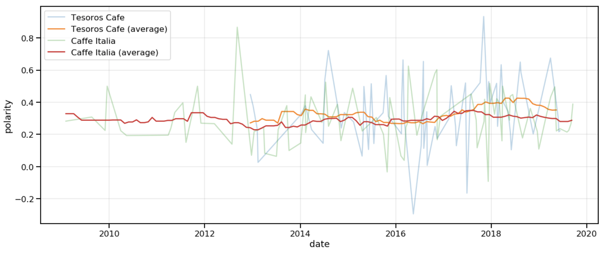
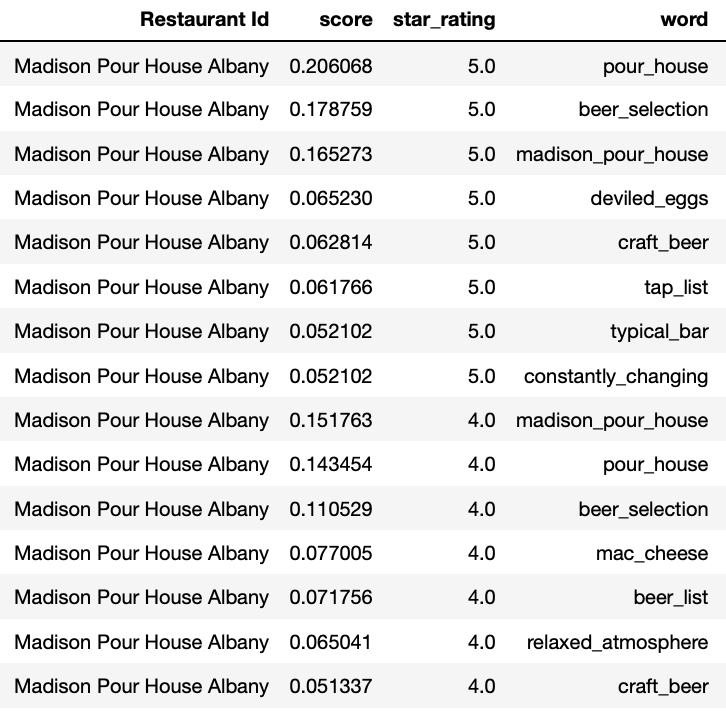
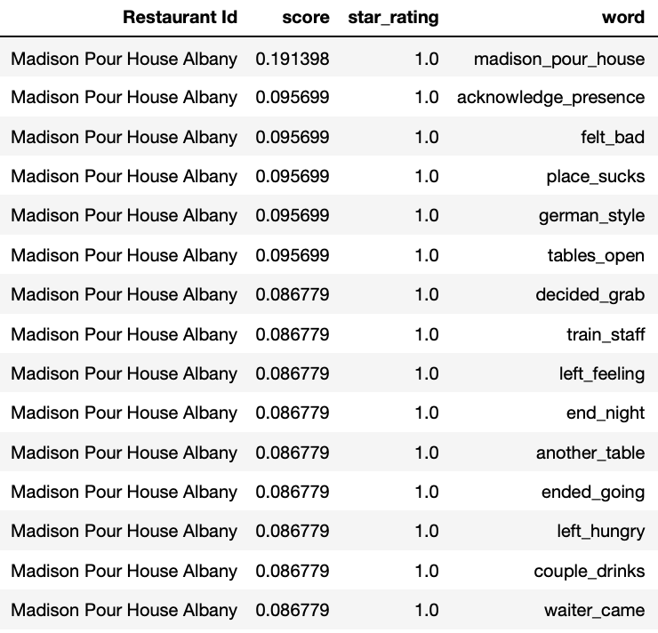
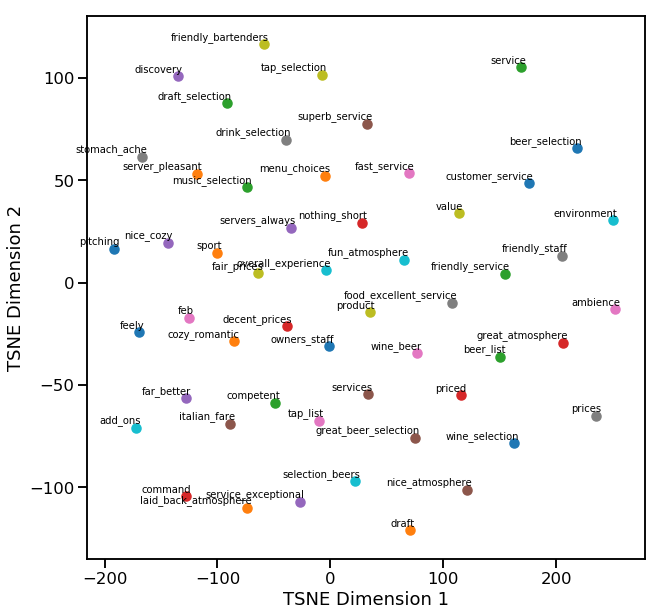
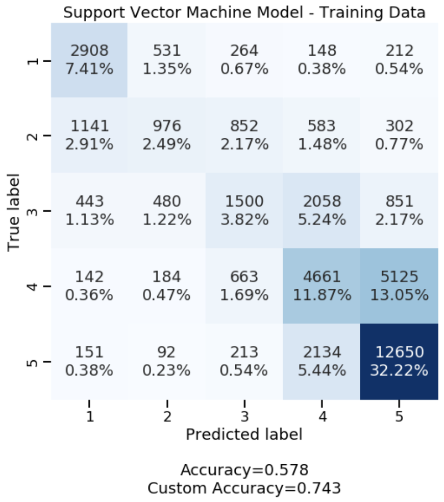
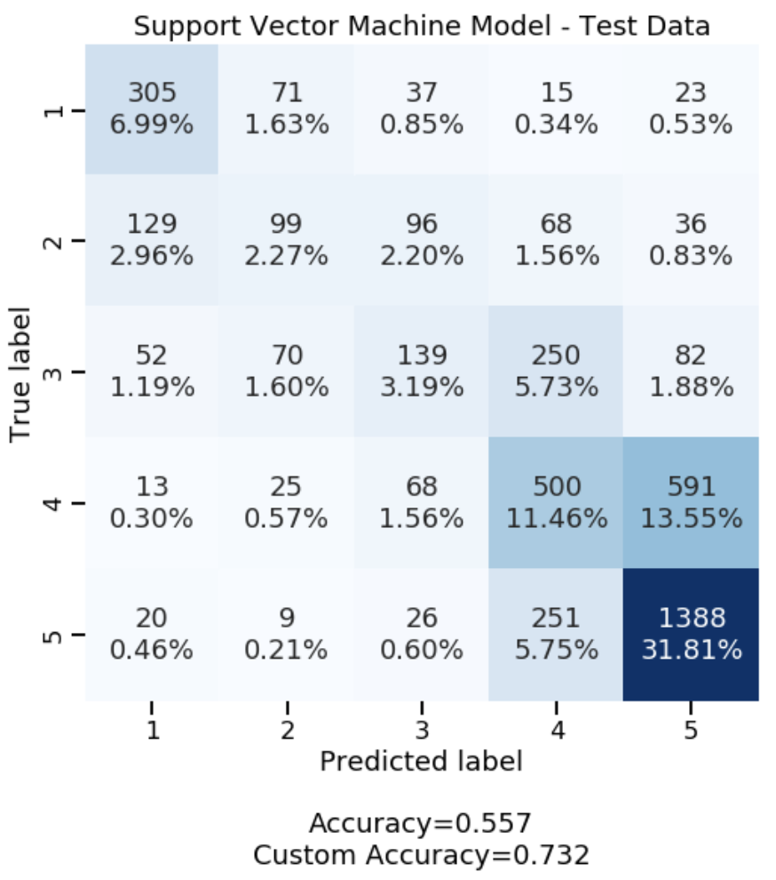

# Restaurant Review Text Analysis

# Outline

This readme summarizes the work completed for a Restaurant Reviews NLP project. The sections contained herein include the following:

* [Abstract](#Abstract)
* [Results Summary](#Results-Summary)
* [Future Work](#Future-Word)
* [Dashboard](#Dashboard)
* [Files and Descriptions](#Files-and-Descriptions)
* [Analysis](#Analysis)
    * [Data Gathering](#Data-Gathering)
    * [NLP & Data Analysis](#NLP-and-Data-Analysis)
        * [Sentiment Distribution](#Sentiment-Distribution)
        * [Sentiment Over Time](#Sentiment-Over-Time)
        * [Keywords Extraction](#Keywords-Extraction)
        * [Most Similar Analysis](#Most-Similar-Analysis)
    * [Data Modeling](#Data-Modeling)

-------

    
# Abstract

This project comprises analysis of review data collected from [yelp.com](https://www.yelp.com) for various restaurants in the Albany, NY area. The goal of the project is to extract important words and phrases from review data for many restaurants at different rating levels and to provide an ability to classify 'unrated' text reviews into a predicted rating level.

**Question/Problem:** How can we leverage yelp review data to give us insights about our business?

**Why?** The ability to analyze and extract information from customers has great value to a business that can leverage that data to continuously improve. Validation of sentiment analysis from review text will allow the same type of analysis to be performed on non-rated, review-like text data that can be found on social media or comment/discussion boards.

**Infomation Generated:**
- Review **text sentiment** compared to star rating.
- Common **phrasing** used in review text.
- Review text **sentiment over time**.
- TF/IDF analysis to determine **keywords** in business star rating levels.
- Word Embedding Analysis to determine **relationships between words** withing the space.
- **Classification of review text** using word embeddings.

**Process:** First, Data Gathering was performed with all review data being scraped prior to analysis. Then, data cleaning, word/document embeddings and keyword analysis were performed. Lastly, classification models were tuned to the cleaned and tokenized review texts and used to predict rating levels.

-------

# Results Summary

NLP analysis shows that from raw Yelp review text, we can extract useful information for both modeling and business improvement. Sentiment analysis on review text revealed that **review star ratings are consistent with text sentiment**. Sentiment analysis over time allows for a business to measure how its standing relative to competitors has changed over time.

Additionally, **phrase and TF/IDF analysis can be used to extract keywords** from reviews. Applying this analysis to restaurant categories and rating levels allowed for **identification of important key phrases for a business at each rating level**. **Word embeddings** applied in a similar fashion allow for contextual measurment within a category where **most similar words and phrases** are output for a list of keywords or any desired search term. 

**Modeling** of cleaned and tokenized review text shows that raw text can be used to **predict a review star rating**. The implication being that non-rated text gathered from additional resources (Facebook comments, Twitter, etc.) can be classified and used for analysis and keyword extraction. **Keywords are used to help a business identify areas of success and areas where improvement is needed.** 

-------

# Future Work

Additional sources of review-like text data could be gathered and incorporated into the dataset. The text data would be assigned a rating level using the tuned classification model. Then, these reviews can be used to extract keywords, sentiment values, and to generate contextual information in the same manner that scraped reviews were used in this project. 

The classification models themselves can be further improved with adjustments to vector dimensionality, and model parameters.

Additional features to be added include trend analysis of keyword frequency based on time. This would open the door to see what keywords are being used over time for a particular business or within a particular category. Incorporating better word-cloud visualization capability would be a good way to improve presentation of keyword information.

-------

# Dashboard

An online dashboard with a subset of the data can be found at the following link. It allows selection of a restaurant for inspection where a user can view the sentiment and review ratings over time, the distribution of reviews and a visual representation of keywords. From there, individual reviews can be seen based on the selected or manually entered keyword.

Dashboard Link: [https://public.tableau.com/profile/dennis.t2456#!/vizhome/Restaurant_Review_Data/Dashboard1?publish=yes]

-------

# Files and Descriptions
    

<details><summary>USE DROPDOWN</summary>

**All Python work is contained in the following files**:
* **[Project_Data_Gathering.ipynb](Project_Data_Gathering.ipynb)**
  * A jupyter notebook containing web scraping code which gathers data from Yelp. It will gather a list of businesses and business information using a search phrase and location. The scraper will then gather all reviews posted for each business found in the initial query. Data is formatted and saved in two csv files: **business_info.csv** and **reviews.csv**.
* **[Project_NLP.ipynb](Project_NLP.ipynb)** 
  * A jupyter notebook that creates Restaurant and Review objects, conditions review data (clean, tokenize, phrase), and performs various analysis on the review text. This includes review sentiment assignment, sentiment over time, Term Frequency / Inverse Document Frequency (TFIDF) analysis, and word embedding investigation and visualization.
* **[Project_Predict_Ratings.ipynb](Project_Predict_Ratings.ipynbb)** 
  * A jupyter notebook which uses review text to predict ratings on a 1-5 star scale. This notebook will import a csv file containing pre-cleaned and tokenized reviews (from **Project_NLP.ipynb**) and then test various classification models. The notebook compares and contrasts a Random Forest, Support Vector, Logistic Regression and XGBoost model fit to both Gensim Word2Vec vectors, and Stanford NLP GloVe vectors. A Keras LSTM model is also tested and compared to the other models.
* **[data_queries.py](data_queries.py)**
  * This python file reads **business_info.csv** and **reviews.csv** files. It also provides a series of functions used query the business and review data.
* **[data_classes.py](data_classes.py)** 
  * Contains definitions for the Review and Restaurant classes and their associated methods. It also contains a clean_text function and phrase_clear function.
* **[data_analysis.py](data_analysis.pyy)**
  * Contains functions that assist in performing TF/IDF analysis, sentiment analysis, and plotting word embedding vectors in a 2D space.
* **[data_modeling.py](data_modeling.py)** 
  * Contains classes and files that assist in performing GridSearchCV for multiple models. It contains a custom accuracy function which is used as a scorer for model selection in GridSearchCV.
* **[cf_matrix.py](cf_matrix.py)** 
  * Contains a function which makes an informative and pretty plot of a confusion matrix.
  
**Data Files**
* **[model_results.pickle](model_results.pickle)**
  * Contains the selected 'best' model as well as a pandas DataFrame of the summary stats for all models. The content is in the form of a tuple: **(model, model_results_df)**.
* **[business_info.csv](business_info.csv)**
  * Contains a record for each restaurant and the restaurant's basic information - name, address, categories, price range, url, etc. The Github file included is a subset of the data scraped.
* **[reviews.csv](reviews.csv)**
  * Contains a record for each review and the review's basic information - date, restaurant, rating, review text, etc. This Github file included is a subset of the data scraped (file size constraints).

</details>

-------

# Analysis

<details><summary>USE DROPDOWN</summary>

# Data Gathering
All web scraping is completed in [Project_Data_Gathering.ipynb](Project_Data_Gathering.ipynb) notebook. 1081 restaurants were identified using the search query 'restaurants' in 'Albany, NY' on Yelp.com. From those businesses, 59274 reviews were gathered for analysis. A subset of this data is included in the Github repository. There are two different structures of Yelp review pages (using different class labels and slightly different structures), for this reason, two scraping functions are used to collect review data.


# NLP and Data Analysis

The [Project_NLP.ipynb](Project_NLP.ipynb) notebook uses instances of _Restaurant_ and _Review_ objects to organize and process the data. A Restaurant contains a list of reviews. Review objects contain methods for cleaning, tokenizing, stopword removal, polarity assignment, and general extraction of review text in various formats. Restaurant objects contain methods for adding reviews, extracting various review summary information (time/sentiment), retrieving review objects or review text in various formats.

## Sentiment Distribution

Review sentiment distributions by star rating show distinct peaks with review positivity increasing with each star rating. Sentiment was measured using the python `textblob` library. The distribution of sentiment validates that review text itself is a good indicator for star rating. See distribution for all reviews below:





The NLP jupyter notebook further allows sentiment distribution based upon a category search term.

## Sentiment Over Time

Once sentiment has been applied to each review object, review sentiment over time for a specific restaurant or a list of restaurants (for comparison purposes) can be viewed.



## Keywords Extraction

Phrasing of review text was performed using `Phraser` from `gensim.models.phrases`. The text was fit and transformed using the phraser twice. The first time to generate bigrams, the second to generate trigrams. Once phrasing was completed. Before the phrasers were applied, stopwords were removed (this proved to give more informative phrase results).

Keywords were extracted for each restaurant within by star rating level. This was done by performing TF/IDF analysis for a restaurants reviews (as a document) compared to other restaurants within common cuisine type categories. An `sklearn.feature_extraction.text.TfidfVectorizer` was used to fit documents and retrieve TF/IDF scores for words from specific documents.

**Example Restaurant:** Madison Pour House - _American (New), Pubs_

Positive Ratings           |  Negative Ratings
:-------------------------:|:-------------------------:
  |  


## Most Similar Analysis

Word similarities can be seen through the use of word embedding models created at the rating level as well as the individual restaurant level. A `gensim.models.Word2Vec` vectorizer was used with 20 dimensions to create word vector models.

Most similar words/phrases to **beer_selection, draft,** and **service** using word vector models created for each rating level:

* **5.0 rating:** beer_list, drink_selection, selection_beers, family_owned_restaurant, services, people_work, wine_selection, noshes
* **4.0 rating:** beer_list, open_till, drink_menu, beers_tap, wine_list, selection_tap, eclectic_menu, service_impeccable
* **3.0 rating:** wine_list, entertainment, positives, excellent_service, wine_selection, servers_always, payton, friendly_wait_staff
* **2.0 rating:** bordering, slow_night, pace, welcoming, outdoor_space, horrible_service, terrible_service, waiter_attentive
* **1.0 rating:** service_terrible, oof, drink_selection, nature, excursion, last_times, though, taste_mouth

Using t-Distributed Stochastic Neighbor Embedding (t-SNE) dimensionality reduction from sklearn.manifold.TSNE, a word cloud displaying word/phrase similarity can be viewed. 

* **5.0 rating** word cloud for same key phrases (beer_selection, draft, and service).



# Data Modeling

In order to predict star rating for any block of text, various models were tested using GridSearchCV and Pipelines from sklearn. The model-types tested were: Random Forest, Support Vector Machine, Logistic Regression, XGBoost, and a Keras LSTM Network.

**CLASSIFICATION METRIC USED** 

**Custom Accuracy.** Accuracy is the percentage of correct predictions. The custom accuracy score used is a modified version of the traditional accuracy score. As reviews are rated on a 1-5 scale, full credit is given to correct preditions and 50% credit to predictions that are 1 star rating away from the true label (i.e. 50% credit given to 1-star predictions when the true label is 2-stars). This was seen as a better optimization metric as misclassification in an adjacent group is better than other misclassifications.

**MODEL TYPE CHOSEN** 
- sklearn.svm.SVC - Support Vector Classifier

**MODEL PARAMETERS** 
- *gamma*='auto' 
- *C*=1.0
- *kernel*='rbf'

**CONFUSION MATRIX**

Training Data           |  Test Data
:-------------------------:|:-------------------------:
  |  


Notes:

The Keras LSTM Network model performed very well. In fact, it performed better than the SVC model on both the training and test data. However, I chose the SVC model because it was less prone to overfitting and performed similarly between the training data and test data.

</details>

-------


```python

```


```python

```


```python

```
